# ReviveUSD

**The first CDP stablecoin protocol on Polkadot Hub.**

Lock native PAS as collateral, mint **rUSD** — a USD-pegged stablecoin — and manage your position through a clean web UI. Deployed live on Passet Hub testnet.

Built for the [Polkadot Solidity Hackathon 2026](https://dorahacks.io/hackathon/polkadot-solidity-hackathon/detail) · EVM Smart Contracts track.

---

## Overview

Polkadot Hub is bringing serious DeFi liquidity to the ecosystem, but it arrives without a native stablecoin. ReviveUSD fills that gap.

It is a **Collateralized Debt Position (CDP)** protocol — the model pioneered by MakerDAO — reimplemented from scratch in Solidity and compiled to **PolkaVM** via `resolc`. Users deposit native PAS tokens as collateral and mint **rUSD**, a soft-pegged USD stablecoin backed entirely on-chain. No bridges, no wrapped tokens, no off-chain dependencies.

**Why this matters for the ecosystem:**

- Polkadot Hub has no decentralized stablecoin today. rUSD is a first step toward that.
- A stablecoin unlocks the rest of DeFi: lending, DEXs, yield strategies — all need a stable unit of account.
- Using native PAS as collateral ties rUSD's value directly to the Polkadot Hub economy, rather than importing risk from another chain.

---

## Live Deployment (Passet Hub Testnet)

| Contract | Address |
|----------|---------|
| RUSD     | [`0xe321098307B309bAab006e8600439a1c948f0860`](https://blockscout-testnet.polkadot.io/address/0xe321098307B309bAab006e8600439a1c948f0860) |
| Oracle   | [`0x5A2B2C4750c1034d39f30441642C8Be220F52618`](https://blockscout-testnet.polkadot.io/address/0x5A2B2C4750c1034d39f30441642C8Be220F52618) |
| Vault    | [`0xA3cc725D53D69Aa5e570D73390c152f76F7BC0CE`](https://blockscout-testnet.polkadot.io/address/0xA3cc725D53D69Aa5e570D73390c152f76F7BC0CE) |

- **Chain:** Passet Hub Testnet (Chain ID `420420417`)
- **RPC:** `https://eth-rpc-testnet.polkadot.io/`
- **Explorer:** [blockscout-testnet.polkadot.io](https://blockscout-testnet.polkadot.io)

---

## How It Works

ReviveUSD is a Collateralized Debt Position (CDP) protocol — the same model powering MakerDAO/DAI, but running natively on Polkadot Hub via `pallet-revive`.

```
User deposits PAS → opens a Vault position
           ↓
     Vault checks collateral ratio ≥ 150%
           ↓
     User mints rUSD (USD-pegged stablecoin)
           ↓
  5% annual stability fee accrues continuously
           ↓
  User repays rUSD debt → withdraws PAS collateral
```

**Key parameters:**

| Parameter | Value |
|-----------|-------|
| Minimum collateral ratio | 150% |
| Liquidation threshold | 130% |
| Liquidation penalty | 10% |
| Stability fee | 5% APY |

---

## Screenshots

**Wallet connected to Passet Hub Testnet (Chain ID 420420417)**

Rabby wallet showing a real PAS balance on the custom network, confirming the app runs on Polkadot's asset hub — not a standard EVM chain.

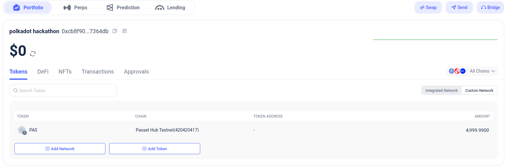

---

**Dashboard — live protocol stats**

The dashboard shows the current PAS/USD oracle price, total rUSD supply, and the accrued stability fee since deployment. The wallet address is visible in the top-right corner.

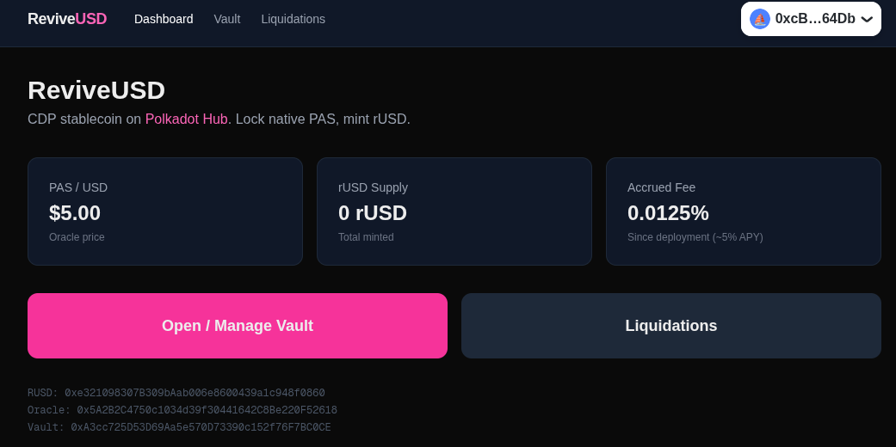

---

**Vault — before opening a position**

A freshly connected wallet with no active vault. The collateral ratio meter shows ∞ (no debt), and the wallet balance of ~5000 PAS is displayed.

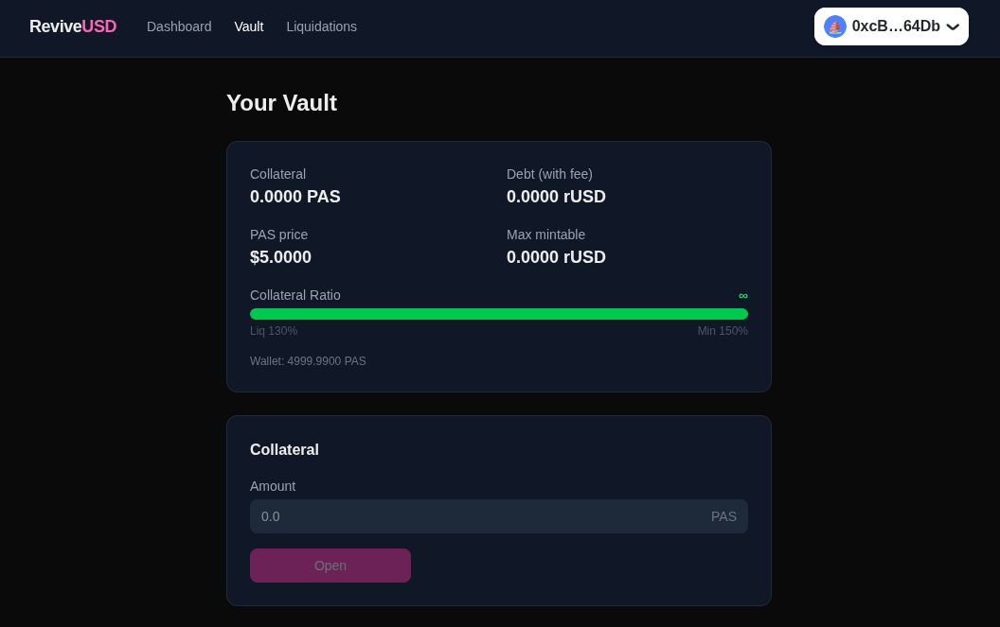

---

**Vault — entering collateral amount**

The user has entered 10 PAS as collateral and is about to open a new CDP position by clicking Open.

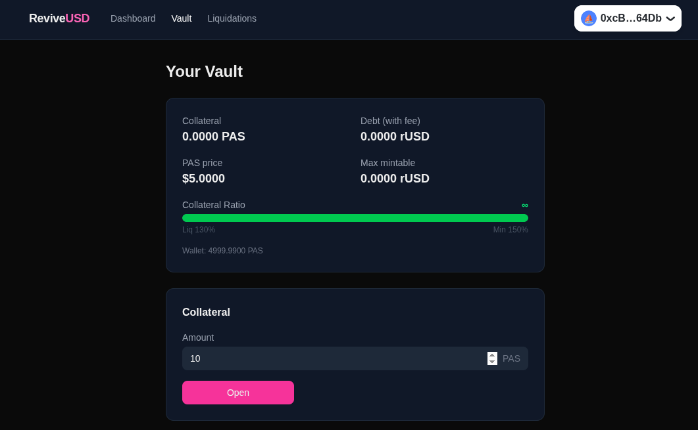

---

**Rabby transaction confirmation**

Rabby shows the raw transaction being sent to the Vault contract on Passet Hub Testnet — chain ID 420420417, value of 10 PAS, gas estimated at ~2.4 PAS.

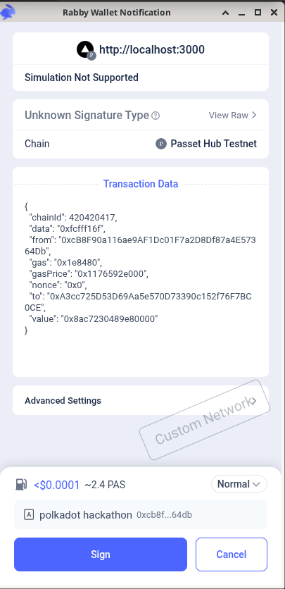

---

**Vault — active position with 10 PAS collateral**

After the transaction confirms, the vault shows 10 PAS collateral, 0 rUSD debt, a $5.00 PAS price, and 33.33 rUSD available to mint. The Debt section with Mint/Burn buttons is now visible. Collateral ratio is ∞ (no debt outstanding).

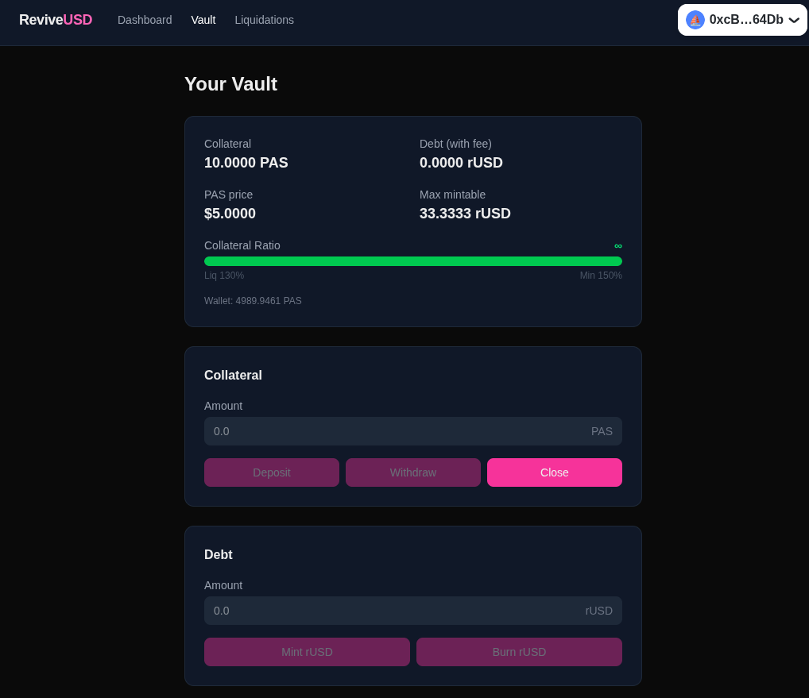

---

**Liquidations — healthy protocol**

No positions are below the 130% liquidation threshold. The page is functional and ready to surface undercollateralized vaults when they appear.

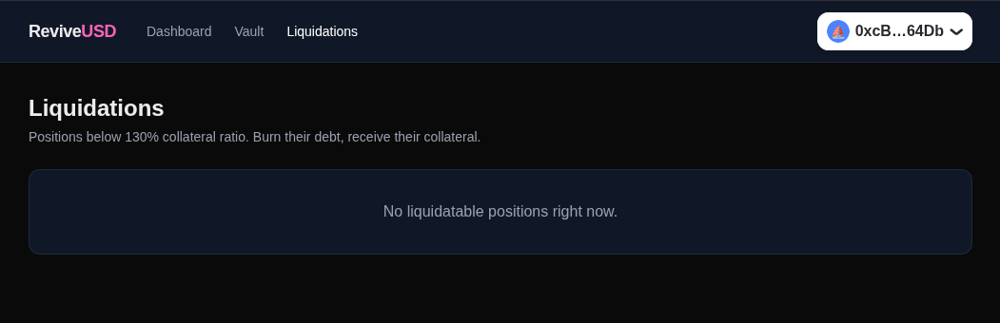

---

**Blockscout — Vault contract on testnet**

The Vault contract on Blockscout with 37 transactions. The most recent is the `open()` call from the user's wallet (0xcB...64Db), confirmed successfully 11 minutes ago with 10 PAS sent as collateral.

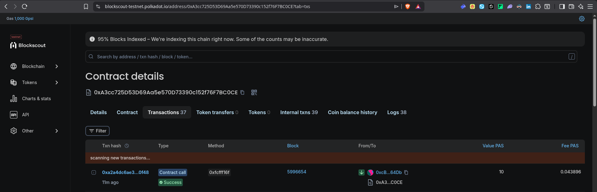

---

**Vault — entering rUSD mint amount**

With an active position open, the user enters 10 rUSD in the Debt section (within the 33.33 rUSD max mintable limit) and is about to click Mint rUSD.

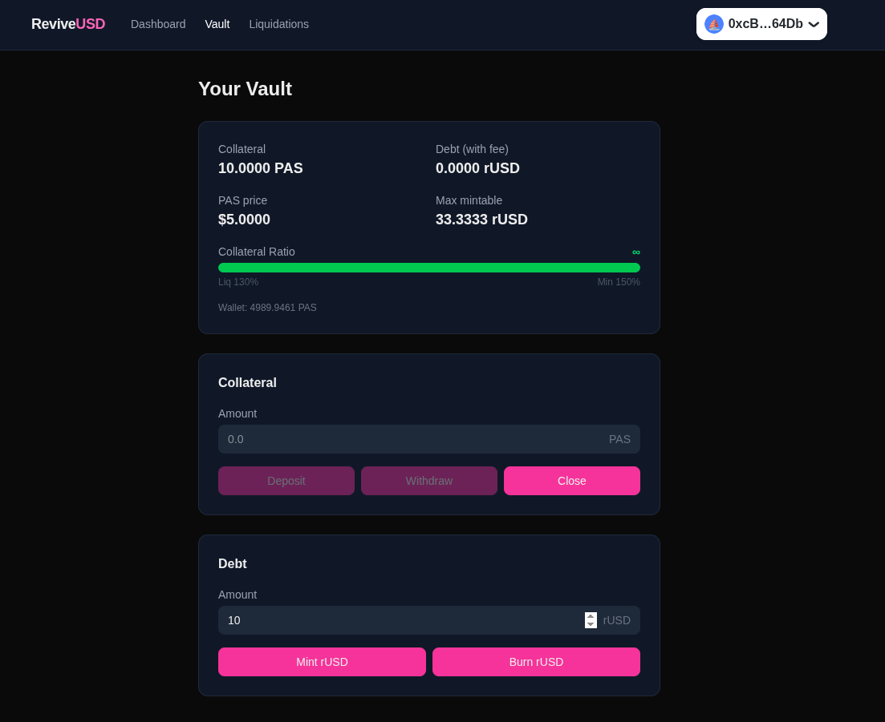

---

**Rabby confirmation — mint rUSD transaction**

Rabby shows the `mint()` call being sent to the Vault contract on Passet Hub Testnet. Gas estimated at ~2.4 PAS.

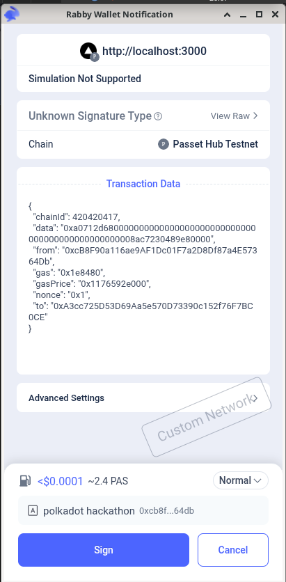

---

**Vault — after minting 10 rUSD**

The position now shows 10 rUSD debt, a collateral ratio of 499% (well above the 150% minimum), and max mintable reduced to 23.33 rUSD. The Burn rUSD button is now actionable.

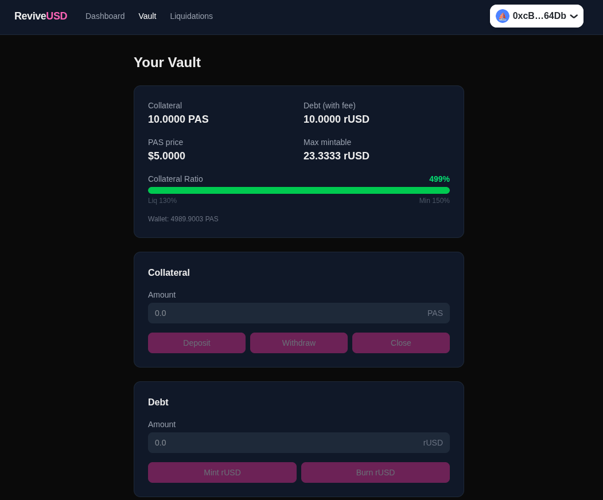

---

**Dashboard — updated protocol state**

After minting, the dashboard reflects the on-chain state: rUSD supply is now 10 rUSD and the accrued stability fee has ticked up to 0.0137% since deployment.

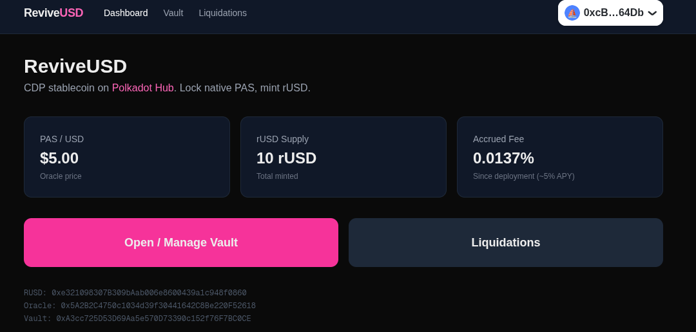

---

## Architecture

```
src/
├── RUSD.sol      ERC-20 stablecoin, mint/burn controlled by Vault
├── Vault.sol     CDP engine: open/deposit/withdraw/mint/burn/close/liquidate
└── Oracle.sol    Owner-settable price feed (demo oracle)

frontend/
├── app/          Next.js App Router pages (Dashboard, Vault, Liquidations)
├── lib/          wagmi config, contract ABIs, chain setup
└── e2e/          Playwright end-to-end tests

test/             Forge unit, integration, and invariant tests (51 passing)
script/           Deployment helpers and smoke test
deployments/      Live contract addresses (testnet.json)
```

---

## Polkadot Hub Integration

This project is compiled to **PolkaVM** (RISC-V bytecode) via `resolc`, the Solidity→PolkaVM compiler, and deployed on Passet Hub — not to a standard EVM chain.

Key differences leveraged:
- `--resolc` flag compiles Solidity through Yul → LLVM → RISC-V, enabling native execution in `pallet-revive`
- Native PAS (Polkadot's asset hub token) as collateral — no wrapped token needed
- Deterministic finality (~1 min) vs probabilistic on rollups

---

## Getting Started

### Prerequisites

- [foundry-polkadot](https://github.com/paritytech/foundry-polkadot)
- Node.js 20+

```sh
curl -L https://raw.githubusercontent.com/paritytech/foundry-polkadot/refs/heads/master/foundryup/install | bash
foundryup-polkadot
```

### Smart Contracts

```sh
# Clone the repo
git clone https://github.com/fgimenez/revive-usd.git
cd revive-usd

# Build (resolc required — standard forge build will fail on Polkadot Hub)
forge build --resolc

# Run tests (against local Anvil)
forge test
forge test -vvv                                            # verbose
forge test --match-test testName                          # single test
forge test --match-test "invariant_" --fuzz-runs 10000   # invariant suite
```

### Frontend

```sh
cd frontend
npm install
npm run dev          # dev server at http://localhost:3000
npm run test:e2e     # Playwright E2E tests (mocked RPC, no testnet needed)
```

The frontend connects to Passet Hub testnet by default. Set `NEXT_PUBLIC_NETWORK=testnet` in `frontend/.env` (already set).

Add Passet Hub testnet to MetaMask:

| Field | Value |
|-------|-------|
| Network name | Passet Hub Testnet |
| RPC URL | `https://eth-rpc-testnet.polkadot.io/` |
| Chain ID | `420420417` |
| Currency symbol | `PAS` |
| Block explorer | `https://blockscout-testnet.polkadot.io` |

Get testnet PAS from the [faucet](https://faucet.polkadot.io/?parachain=1111) (select Passet Hub on Paseo — requires SS58 address).

---

## Deploying Yourself

```sh
export RPC=https://eth-rpc-testnet.polkadot.io/
export PK=<your-private-key>

forge create src/RUSD.sol:RUSD --resolc --rpc-url $RPC --private-key $PK --broadcast
forge create src/Oracle.sol:Oracle --resolc --rpc-url $RPC --private-key $PK --broadcast \
  --constructor-args 5000000000000000000
forge create src/Vault.sol:Vault --resolc --rpc-url $RPC --private-key $PK --broadcast \
  --constructor-args <RUSD_ADDR> <ORACLE_ADDR>
cast send <RUSD_ADDR> "setVault(address)" <VAULT_ADDR> --rpc-url $RPC --private-key $PK
```

---

## CI

| Job | Trigger | What it does |
|-----|---------|--------------|
| `test` | every PR & push | `forge build --resolc` + all Forge tests |
| `e2e` | every PR & push | Playwright E2E with mocked RPC |
| `e2e-testnet` | push to `main` | Playwright E2E against live Passet Hub |
| `testnet-smoke` | push to `main` | full lifecycle: open → mint → burn → close on testnet |

---

## Roadmap

- [ ] Decentralized oracle (Chainlink / DIA once available on Passet Hub)
- [ ] Governance token and on-chain parameter voting
- [ ] XCM integration: accept DOT and other parachain assets as collateral
- [ ] Frontend hosted deployment
- [ ] Audit

---

## License

Apache License 2.0
